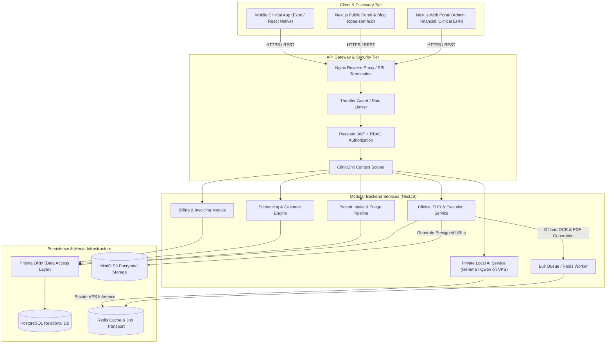

# CPAE Healthcare Ecosystem — Architecture Case Study


> **Architectural case study of a production-grade multi-unit clinical management, Electronic Health Records (EHR), public health portal, and self-hosted AI ecosystem built with NestJS, Next.js, Prisma, PostgreSQL, Redis/Bull queues, MinIO object storage, and private LLMs.**

---

## 🔒 Private Source Notice

```
Production source code is proprietary and confidential due to clinical operations
and sensitive healthcare privacy regulations (Brazilian LGPD standards).
This public repository contains sanitized architecture documentation, design patterns,
data flow specifications, and engineering trade-offs.
No proprietary code, API secrets, or clinical patient records are published here.
```

---

## 1. Executive Summary & Ecosystem Overview

**CPAE (Centro Psicopedagógico e Apoio Emocional)** is an extensive multidisciplinary healthcare and educational ecosystem operating in production at [sistema.clinicacpae.com.br](https://sistema.clinicacpae.com.br). Rather than a single monolithic web application, the ecosystem encompasses four integrated operational pillars:

| Pillar | Service / Subsystem | Purpose & Technologies |
|---|---|---|
| **Clinical Core & EHR** | `sistema.clinicacpae.com.br` | Comprehensive Electronic Health Records, progress evolutions (`Evoluções Clínicas`), medical attachment management, appointment grids, and financial operations. Powered by **NestJS, Next.js, PostgreSQL, Prisma, MinIO, Bull/Redis**. |
| **Public Portal & Blog** | `cpae-zen-hub` | Institutional patient discovery portal, health education blog, service catalog, and SEO-optimized public landing pages. Built with **Next.js, Tailwind CSS, and Server-Side Rendering (SSR)**. |
| **Automated Triage & Intake** | Automated Onboarding Engine | Intelligent patient triage and lead acquisition workflows reducing onboarding friction and routing incoming patients to appropriate clinical specialists. |
| **Self-Hosted Clinical AI** | Local LLM Telemetry (Luna) | Quantized open-weights models (**Google Gemma** & **Qwen**) running directly on dedicated Linux VPS infrastructure for clinical note structuring, triage assistance, and automated operational telemetry without data leakage. |
| **Mobile Care Client** | Mobile Companion App | Cross-platform clinician and patient companion application built with **React Native / Expo**. |

---

## 2. Engineering Role & Ownership (Solo Architect & Engineer)

As the primary architect and lead software engineer on the project, I designed and developed the platform from scratch:

1. **Full-Stack Application Development:** Implemented the NestJS backend API, Next.js administrative and clinical web portal, and Expo mobile app.
2. **Multi-Unit Architecture:** Engineered domain-level data segregation across clinical facilities (`ClinicUnit`, `UserClinicUnit`, `PatientClinicUnit`) with granular Role-Based Access Control (RBAC).
3. **Automated Patient Triage & Lead Acquisition:** Built intelligent patient onboarding pipelines that categorize initial clinical complaints and route intake records directly to matching specialists.
4. **Asynchronous Task Architecture:** Built Bull/Redis job queues for background processing including clinical PDF synthesis, immutable audit logging, and document OCR intake for patient exams.
5. **S3-Compatible Clinical Storage:** Designed secure medical media storage via MinIO, utilizing time-limited, encrypted presigned URLs to prevent direct asset exposure.
6. **Privacy & LGPD Controls:** Engineered comprehensive consent management (`PatientConsent`), granular access logging (`AccessLog`, `AuditLog`), and data isolation aligned with Brazilian healthcare privacy standards (LGPD).
7. **Self-Hosted AI Infrastructure:** Provisioned and orchestrated private VPS instances running quantized local LLMs for clinical note assistance, ensuring sensitive patient health information never traverses third-party cloud APIs.
8. **DevOps & Linux Infrastructure:** Orchestrated containerized Docker deployments, automated daily PostgreSQL snapshots, and configured Nginx reverse proxy with SSL termination and HTTP/2 multiplexing.

---

## 3. High-Level System Architecture



---

## 4. Multi-Unit Data Isolation & Granular RBAC

Rather than relying on fragile client-side filters, CPAE implements strict domain-layer data isolation:

### 4.1 Multi-Unit Clinical Scoping
- The clinic ecosystem supports multiple operating facilities through `ClinicUnit` relations.
- Medical professionals, administrative staff, and patients are associated via join entities (`UserClinicUnit`, `PatientClinicUnit`), ensuring users only access records belonging to their authorized clinical units.
- Service repositories inject the active `clinicUnitId` into Prisma query filters automatically across all clinical queries.

### 4.2 Granular RBAC Hierarchy
The system defines six core operational roles with granular permission overrides (`UserModulePermission`):
- `ADMIN`: Global unit configuration, audit log review, and user provisioning.
- `PROFESSIONAL`: Full access to assigned patients' EHR, clinical notes, prescriptions, and exam attachments.
- `RECEPTIONIST`: Patient intake, appointment scheduling, and unit check-in; strictly isolated from clinical consultation notes.
- `FINANCIAL`: Invoicing, payments, and insurance reconciliation; zero access to clinical diagnostic records.
- `COORDINATOR`: Operational workflow oversight across multiple units.
- `PATIENT`: Self-service appointment scheduling, historical prescriptions, and educational content.

---

## 5. Security, Privacy & LGPD Healthcare Compliance

Operating in the healthcare domain requires rigorous data sovereignty and privacy controls:
- **Consent Lifecycle Tracking (`PatientConsent`):** Tracks explicit patient authorization for data processing, medical record storage, and communications, including timestamped revocation histories.
- **Immutable Audit & Access Trails (`AuditLog`, `AccessLog`):** Every access to patient EHR files, diagnostic notes, and personal identifiers is logged with user ID, IP address, timestamp, and action type for forensic traceability.
- **Presigned Medical Media:** Medical documents, radiographic images, and lab exams are stored in private MinIO S3 buckets. Assets are never served publicly; the API issues short-lived, encrypted presigned URLs valid for 15 minutes.
- **Data Sovereignty with Local AI:** Clinical note structuring and intelligent triage utilize self-hosted Google Gemma and Qwen models running directly on dedicated Linux VPS instances. Patient identifiers are stripped before inference, and prompt data never leaves the self-managed infrastructure.

---

## 6. Engineering Deep Dives & Documentation

Detailed engineering breakdown documents are available in the [`docs/`](./docs) directory:

- [**System Architecture & Service Boundaries**](./docs/architecture.md) — Module breakdown, tenant isolation, and service contracts.
- [**Technical Decisions & Trade-Offs**](./docs/technical-decisions.md) — Why NestJS, Prisma vs Knex/Kysely, MinIO vs cloud S3, and schema trade-offs.
- [**Data Flow & State Lifecycle**](./docs/data-flow.md) — Step-by-step walkthrough of clinical record creation and document pipelines.
- [**Security & Healthcare Compliance**](./docs/security.md) — RBAC matrices, PII sanitization, tenant isolation enforcement, and audit logs.
- [**Testing & Verification Strategy**](./docs/testing.md) — Unit testing, e2e integration tests, and schedule audit tooling.

---

## 7. Technology Stack Verification

All technologies listed are verifiable directly in the production dependency trees:

| Domain | Technology | Production Package | Role |
|---|---|---|---|
| **Backend Framework** | NestJS 11 | `@nestjs/core`, `@nestjs/common` | Modular monolith enterprise backend |
| **Language** | TypeScript 5.7 | `typescript` | Strict type safety across domain models |
| **ORM** | Prisma 6.19 | `@prisma/client`, `prisma` | Database migrations and relational queries |
| **Primary Database** | PostgreSQL 16 | `pg` | ACID relational persistence |
| **Queue Engine** | Bull 4.16 | `bull`, `@nestjs/bull` | Asynchronous task orchestration |
| **In-Memory Cache** | Redis | `ioredis` | Rate limiting, session store, queue transport |
| **Object Storage** | MinIO SDK 8.0 | `minio` | S3-compliant medical document storage |
| **Document Processing** | Tesseract.js / pdf-lib | `tesseract.js`, `pdf-lib`, `docx` | Medical document parsing, report generation |
| **Frontend** | Next.js 16 / React 19 | `next`, `react`, `react-dom` | Server-side rendered responsive web UI |
| **Styling** | TailwindCSS v4 | `tailwindcss`, `@tailwindcss/postcss` | Utility-first design system |
| **Mobile** | Expo | `react-native`, `expo` | Cross-platform clinician mobile tool |
| **Containerization** | Docker | `docker-compose.yml` | Containerized staging and production hosts |
| **Local AI Telemetry** | Google Gemma / Qwen | Self-hosted Ollama on VPS | Private clinical note assistance and triage |

---

## 8. License & Credits

- Architectural documentation: **CC-BY-NC 4.0**
- Architect & Lead Implementer: **Leonardo Santana** ([@leonardosantana214](https://github.com/leonardosantana214))
- Live Platform: [sistema.clinicacpae.com.br](https://sistema.clinicacpae.com.br)
