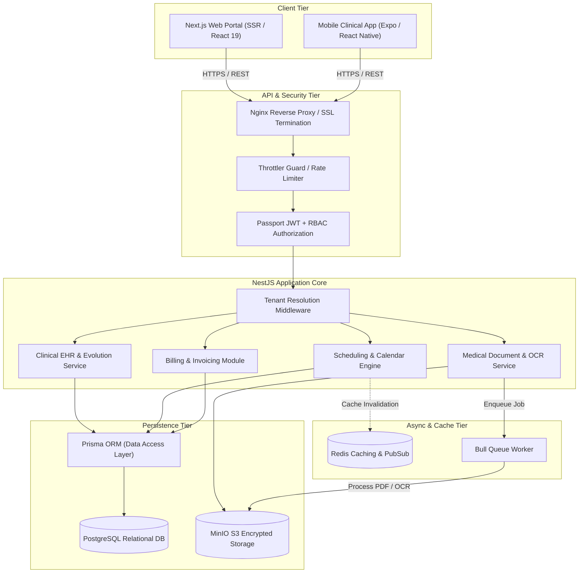

# CPAE Healthcare SaaS — Architecture Case Study


> **Architectural case study of a production-grade multi-tenant clinical management and Electronic Health Records (EHR) SaaS ecosystem built with NestJS, Next.js, Prisma, PostgreSQL, Redis/Bull queues, and MinIO object storage.**

---

## 🔒 Private Source Notice

```
Production source code is proprietary and private due to client/project confidentiality
and patient health data regulations (LGPD / HIPAA compliance standards).
This public repository contains sanitized architecture documentation, design patterns,
data flow specifications, and engineering trade-offs.
No proprietary code, API secrets, or clinical patient records are published here.
```

---

## 1. Executive Summary

| Parameter | Specification |
|---|---|
| **System Type** | Multi-Tenant Healthcare Clinical Management & EHR SaaS |
| **Primary Domain** | Psychological, Neuropsychological, and Multidisciplinary Clinical Practice |
| **Live Production** | `sistema.clinicacpae.com.br` |
| **Core Architecture** | Modular Backend (NestJS), Modern SSR Frontend (Next.js), Mobile App (Expo/React Native) |
| **Data Layer** | PostgreSQL (relational) + Prisma ORM + Redis (caching & job queues) |
| **Object Storage** | MinIO (Self-hosted S3-compatible storage for medical attachments and PDF reports) |
| **Deployment** | Docker Compose on Linux VPS with automated staging and production pipelines |

---

## 2. What I Built & Core Responsibilities

As a core full-stack software engineer on the project, I designed and implemented:

1. **Multi-Tenant Architecture:** Structured tenant isolation separating clinical practices, patient data, staff schedules, and billing registries under unified multi-tenant database designs.
2. **Role-Based Access Control (RBAC):** Implemented fine-grained permission guards ensuring administrative staff (reception, billing) have zero read/write access to confidential psychological and medical progress notes (`Evoluções Clínicas`), while clinical practitioners have access restricted to assigned patients.
3. **Asynchronous Processing Pipeline:** Structured Redis and Bull-backed queue workers for background processing of clinical report generation, automated PDF exports, and OCR processing.
4. **Document & Medical Attachment Pipeline:** Integrated MinIO S3 object storage for encrypted storage of clinical reports, test protocols, and neuropsychological evaluation documents.
5. **Dynamic Scheduling & Audit Engine:** Built scheduling conflict resolution mechanisms, recurring weekly session management, and automated schedule audit scripts.

---

## 3. High-Level System Architecture



---

## 4. Engineering Deep Dives & Documentation

Detailed engineering breakdown documents are available in the [`docs/`](./docs) directory:

- [**System Architecture & Service Boundaries**](./docs/architecture.md) — Module breakdown, tenant isolation, and service contracts.
- [**Technical Decisions & Trade-Offs**](./docs/technical-decisions.md) — Why NestJS, Prisma vs Knex/Kysely, MinIO vs cloud S3, and schema trade-offs.
- [**Data Flow & State Lifecycle**](./docs/data-flow.md) — Step-by-step walkthrough of clinical record creation and document pipelines.
- [**Security & Healthcare Compliance**](./docs/security.md) — RBAC matrices, PII sanitization, tenant isolation enforcement, and audit logs.
- [**Testing & Verification Strategy**](./docs/testing.md) — Unit testing, e2e integration tests, and schedule audit tooling.

---

## 5. Technology Stack Verification

All technologies listed are verifiable directly in the production dependency trees:

| Domain | Technology | Production Package | Role |
|---|---|---|---|
| **Backend Framework** | NestJS 11 | `@nestjs/core`, `@nestjs/common` | Modular monolith enterprise backend |
| **Language** | TypeScript 5.7 | `typescript` | Strict type safety across domain models |
| **ORM** | Prisma 6.19 | `@prisma/client`, `prisma` | Database migrations and relational queries |
| **Primary Database** | PostgreSQL | `pg` | ACID relational persistence |
| **Queue Engine** | Bull 4.16 | `bull`, `@nestjs/bull` | Asynchronous task orchestration |
| **In-Memory Cache** | Redis | `ioredis` | Rate limiting, session store, queue transport |
| **Object Storage** | MinIO SDK 8.0 | `minio` | S3-compliant medical document storage |
| **Document Processing** | Tesseract.js / pdf-lib | `tesseract.js`, `pdf-lib`, `docx` | Medical document parsing, report generation |
| **Frontend** | Next.js 16 / React 19 | `next`, `react`, `react-dom` | Server-side rendered responsive web UI |
| **Styling** | TailwindCSS v4 | `tailwindcss`, `@tailwindcss/postcss` | Utility-first design system |
| **Mobile** | Expo | `react-native`, `expo` | Cross-platform clinician mobile tool |
| **Containerization** | Docker | `docker-compose.yml` | Containerized staging and production hosts |

---

## 6. Key Learnings & Engineering Growth

1. **Tenant Isolation at the Data Layer:** Healthcare data isolation cannot rely solely on application-level filtering. Structuring database constraints and middleware enforcement early is critical to avoiding cross-tenant data leaks.
2. **Decoupling File Storage from Relational Storage:** Large clinical attachments (PDFs, neuropsychological tests) rapidly degrade database backup and migration speeds. Moving files to MinIO S3 object storage with presigned URLs kept the primary database lean and responsive.
3. **Queue-Backed Clinical Reports:** Generating multi-page clinical synthesis documents with dynamic charts and patient histories under synchronous HTTP requests led to timeouts during peak hours. Offloading generation to Bull workers resolved latency spikes.

---

## 7. License & Credits

- Architectural documentation: **CC-BY-NC 4.0**
- Architect & Lead Implementer: **Leonardo Santana** ([@leonardosantana214](https://github.com/leonardosantana214))
- Live Platform: [sistema.clinicacpae.com.br](https://sistema.clinicacpae.com.br)
