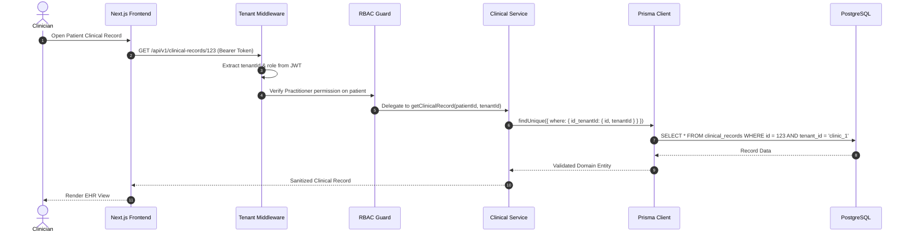

# CPAE Architecture Deep Dive

## 1. Domain Decomposition

The CPAE platform is structured as a **Modular Monolith** using NestJS's dependency injection and module system. This design balances developer velocity with clean boundary isolation.

### Core Modules

```
src/
├── auth/                 # Authentication, JWT issuance, password resets
├── users/                # User lifecycle, practitioner credentials, roles
├── tenants/              # Tenant resolution, clinic branding, configuration
├── patients/             # Patient profiles, anamnesis, clinical intake
├── clinical-records/     # Sensitive EHR evolutions, diagnosis codes, attachments
├── appointments/         # Scheduling grid, recurrence rules, conflict detection
├── billing/              # Session accounting, invoices, payment status tracking
├── documents/            # MinIO S3 integration, presigned URL generation, OCR
├── queues/               # Bull worker consumers for async report generation
└── common/
    ├── guards/           # TenantGuard, RolesGuard, JwtAuthGuard
    ├── interceptors/     # LoggingInterceptor, TransformInterceptor
    └── filters/          # HttpExceptionFilter, PrismaClientExceptionFilter
```

## 2. Multi-Tenancy Strategy

### Architectural Model: Shared Database, Tenant Discriminator Column

To optimize infrastructure cost while ensuring strict isolation across small-to-medium clinical practices:
- Every tenant-scoped entity (`Patient`, `Appointment`, `ClinicalRecord`, `Invoice`) contains an indexed `tenantId` foreign key.
- A custom NestJS interceptor/middleware extracts the tenant context from the authenticated request token.
- Prisma middleware enforces that every database read/write query automatically appends the `WHERE tenantId = :currentTenantId` predicate.



## 3. Storage Architecture (MinIO Object Storage)

Medical files and attachments are separated from the relational store:
1. When a practitioner uploads an assessment file or test result:
   - File metadata (name, MIME type, size, hash, practitioner ID) is saved in PostgreSQL.
   - The file payload is streamed directly into an isolated MinIO bucket partitioned by `tenantId/patientId/UUID`.
2. Retrieval uses short-lived **presigned URLs** (valid for 15 minutes), ensuring files cannot be accessed via direct public links without authentication.
