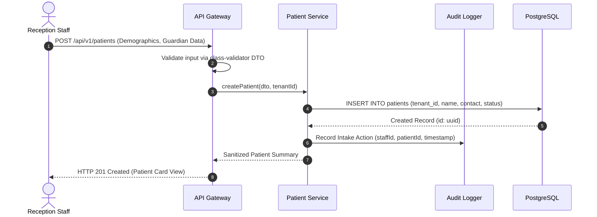

# Data Flow & Lifecycle — CPAE

## 1. Patient Intake & Onboarding Flow



## 2. Clinical Evolution & Document Attachment Pipeline

When a medical or psychological consultation concludes:
1. **Practitioner Drafts Evolution:** Clinical notes are entered via the web portal interface.
2. **Document Attachment (Optional):** Practitioner uploads diagnostic files or test score sheets.
3. **Stream to Object Storage:** File payload is streamed via multipart upload to MinIO into the tenant's isolated bucket path:
   ```
   tenants/{tenantId}/patients/{patientId}/records/{recordId}/{fileUuid}.pdf
   ```
4. **Relational Linkage:** Metadata, file size, storage key, and upload checksum are persisted in PostgreSQL.
5. **Report Generation (Async):** If a consolidated evaluation report is requested, a Bull job is dispatched:
   - Worker retrieves historical notes, demographic data, and standardized diagnostic test scores.
   - Worker renders the PDF document using `pdf-lib` / `docx` templates.
   - Worker uploads the compiled report back to MinIO and updates the record status to `READY`.
