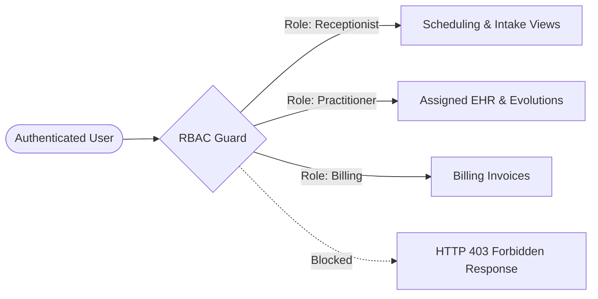

# Security & Healthcare Data Privacy — CPAE

## 1. Threat Model & Compliance Posture

Healthcare systems deal with Special Category Data under Brazilian LGPD (Lei Geral de Proteção de Dados) and international healthcare security principles:
- **Confidentiality:** Patient identities, psychological evaluations, and medical histories must be inaccessible to unauthorized personnel, even within the same organization.
- **Integrity:** Medical notes must be immutable once finalized, preventing retroactive tampering.
- **Availability:** Appointment grids and patient intake files must remain accessible with high uptime during clinical operating hours.

## 2. Granular Role-Based Access Control (RBAC)

The application enforces a 4-tier hierarchical permission model:

| Role | Scheduling & Calendar | Patient Demographics | Financial & Billing | Clinical Records & Notes (EHR) | Medical Attachments |
|---|---|---|---|---|---|
| **Admin / Clinical Director** | Full Access | Full Access | Full Access | Full Access (Within Tenant) | Full Access |
| **Healthcare Practitioner** | Personal Schedule | Assigned Patients Only | Session Status Only | Read/Write (Assigned Only) | Read/Write (Assigned Only) |
| **Receptionist / Front Desk** | Full Schedule Management | Read/Create Intake | Payment Collection | **NO ACCESS (Blocked)** | **NO ACCESS (Blocked)** |
| **Billing Specialist** | View Session Status | Contact Info Only | Full Invoicing & Reports | **NO ACCESS (Blocked)** | **NO ACCESS (Blocked)** |

## 3. Defense-in-Depth Implementation

1. **Helmet & Security Headers:** Enforces Content Security Policy (CSP), HTTP Strict Transport Security (HSTS), X-Content-Type-Options, and X-Frame-Options.
2. **Rate Limiting:** Protects authentication and sensitive patient lookup endpoints using `@nestjs/throttler` (max 10 login attempts per 5-minute sliding window).
3. **Password Security:** Salted hashing with `bcrypt` (10 rounds). Mandatory password change on initial credential issuance.
4. **Presigned URL Expiry:** Storage objects are served via temporary MinIO presigned tokens expiring in 900 seconds. Direct bucket endpoints are firewalled.
5. **PII Log Sanitization:** Application interceptors strip sensitive fields (`cpf`, `password`, `notes`, `diagnosis`) before outputting request logs.
